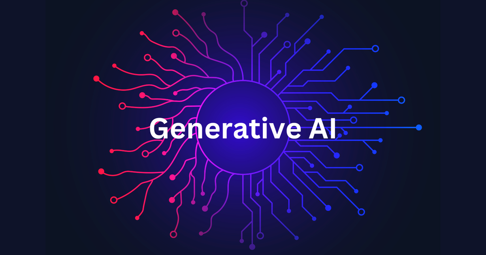

# GenAI Projects

Welcome to the **GenAI Projects** repository! This collection is dedicated to showcasing a wide range of generative AI projects, ranging from beginner-friendly examples to advanced implementations. The goal is to provide a structured and evolving resource for learning, experimenting, and mastering generative AI techniques.

Follow me on Linkedin: \
Follow me on X: 

## Table of Contents

|S.NO| Project Name                | Level      | Key Features                                   | Link                |
|---- |-----------------------------|------------|-----------------------------------------------|---------------------|
|1| Simple Conversational Agent    | Beginner   | Context-aware conversations, history management           | [View](https://github.com/Ajith-Kumar-Nelliparthi/GenAI-Projects/blob/main/ai_agents/simple_conversational_agent.ipynb) |
|2| Simple Question Answering Agent    | Beginner | Query understanding, concise answers   | [View](https://github.com/Ajith-Kumar-Nelliparthi/GenAI-Projects/blob/main/ai_agents/simple_question_answering_agent.ipynb) |
|3| Data Analysis Simple Agent   | Beginner   | Dataset interpretation, natural language queries     | [view](https://github.com/Ajith-Kumar-Nelliparthi/GenAI-Projects/blob/main/ai_agents/Data_Analysis_Simple_Agent.ipynb) |
|4| Introduction to langgraph    | Framework | Modular AI workflows, state management  | [view](https://github.com/Ajith-Kumar-Nelliparthi/GenAI-Projects/blob/main/ai_agents/langgraph_tutorial.ipynb) |

> **Note:** This table will be continuously updated as new projects are added.

## Getting Started

1. Browse the table above to find a project of interest.
2. Follow the instructions in each project folder to set up and run the code.
3. Contributions and suggestions are welcome!

## Contributing

Feel free to open issues or submit pull requests to add new projects, improve documentation, or suggest enhancements.

---

Happy learning and building with Generative AI!